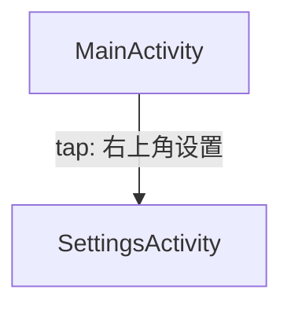

# Midscene 应用自动探索（Android 一期）可执行计划

## 0. 目标与约束（一期）

- 一期目标：基于 Midscene 实现 Android App 自动探索，实时记录探索路径，增量生成页面功能 JSON 与 Mermaid 应用功能图
- 多平台目标（后续）：Android / iOS / HarmonyOS；一期只实现 Android，但所有数据结构与主流程接口预留平台扩展位
- 页面变化判定：仅以 Android `Activity` 名称判定；同一 Activity 的不同 UI 状态视为同一页面
- 两段式程序：
  - 主流程控制（Explorer Orchestrator）：连接设备、截图、调用视觉模型分析、决策、实时落盘、图生成、回溯/重启导航
  - Midscene 执行层（AndroidAgent Adapter）：用 Midscene 驱动设备执行点击/输入/滚动/返回/启动等动作

## 1. 总体架构

### 1.1 主流程控制（Explorer Orchestrator）

- 设备连接与信息获取
  - 连接 adb device（可选 remote adb）
  - 获取当前 Activity（作为唯一页面 id）
  - 截图并落盘
- 视觉分析
  - 输入：两张截图（上一张 + 最新一张）+ 当前 Activity + 配置与提示词
  - 输出：结构化协议（见第 4 节），包含可操作元素列表（可定位描述、动作建议、概率）与弹窗处理建议
- 决策与执行调度
  - 依据弹窗优先级规则、最小可信度阈值、已操作去重、每页最大有效操作次数、最大深度（以 Activity 图最短路径）选择下一步动作
  - 调用 Midscene 执行层完成实际操作
  - 操作后再次截图并与上一张做对比，判定“操作是否生效”
- 状态持久化（实时、同步）
  - 维护 `pages.json`（按 Activity 聚合）
  - 维护 `graph.mmd`（仅记录导致 Activity 变化的边）
  - 可选维护 `steps.jsonl`（逐步日志，便于回放/排障）

### 1.2 Midscene 执行层（AndroidAgent Adapter）

- 对外提供统一接口（供主控调用）
  - `tap(describeForLocate)`
  - `input(describeForLocate, text, mode)`
  - `scroll(direction, locate?)`
  - `back/home/recentApps/launch/terminate/runAdbShell`
- 内部使用 `@midscene/android` 的 `AndroidAgent` + `AndroidDevice` 完成实际动作

## 2. 配置体系（YAML + .env）

### 2.1 .env（敏感与环境项）

- 设备与工具链：
  - `ANDROID_DEVICE_ID=...`
  - `ANDROID_ADB_PATH=...`（如 adb 不在 PATH）
  - `REMOTE_ADB_HOST=...` / `REMOTE_ADB_PORT=...`（可选）
- 模型相关（示例，仅占位）：
  - `MODEL_PROVIDER=...`
  - `MODEL_API_KEY=...`
  - `MODEL_BASE_URL=...`

### 2.2 config.yaml（可版本化）

- 平台（一期固定 android，但结构预留）
- 主页 Activity（禁止在主页 back）
- 探索策略
  - `minActionProbability`：最小可信度阈值（低于则不操作）
  - `maxDepth`：最大探索深度（按 Activity 图最短路径）
  - `maxEffectiveOpsPerPage`：单页面最大“有效操作”次数上限（仅当操作生效才 +1）
  - `maxAttemptsPerElement`：单元素最大尝试次数
  - `topKCandidates`：每轮候选 top-k
- 视觉提示词扩展
  - `extraPrompt`：外部追加提示词，拼接到默认提示词之后

## 3. 运行产物与文件命名

### 3.1 运行目录结构

- `runs/<runId>/screens/`
- `runs/<runId>/pages.json`
- `runs/<runId>/graph.mmd`
- `runs/<runId>/steps.jsonl`（可选）

### 3.2 截图命名规则（每一步）

- 命名格式：
  - `{stepId}-{Activity短名}-{操作元素简单描述}.png`
- 示例：
  - `0001-MainActivity-初始页.png`
  - `0002-MainActivity-右上角设置按钮.png`
  - `0003-SettingsActivity-进入设置后.png`

说明：
- `Activity短名`：建议取 Activity 全限定名最后一段（如 `com.example.MainActivity` -> `MainActivity`）
- “操作元素简单描述”：来自当前决策选中的元素描述的精简版（需做文件名安全化：去除特殊字符、截断长度）

## 4. 视觉分析输出协议（先定稿）

### 4.1 输入（主控 -> 视觉模型）

主控每轮必须给视觉模型 2 张截图：
- `prevScreenshot`：上一轮截图
- `currScreenshot`：最新截图（刚执行动作后或刚进入页面时）

同时提供上下文：
- `activityFullName`：adb 获取到的 Activity（主控提供，作为事实来源）
- `homeActivityFullName`：配置的主页 Activity
- `explorerRules`：阈值、最大有效操作次数等关键策略参数（可选）
- `promptExtra`：来自 YAML 的外部提示词（追加到默认提示词后）

### 4.2 输出（视觉模型 -> 主控）JSON Schema（逻辑结构）

视觉模型输出必须为严格 JSON（不允许额外文本），结构如下：

```json
{
  "activityFullName": "com.example.app.MainActivity",
  "popup": {
    "hasPopup": true,
    "popupType": "permission | exit_confirm | upgrade_ad | tip_overlay | none | unknown",
    "priority": 100,
    "recommended": {
      "action": "tap | back | input | scroll | none",
      "targetDescribeForLocate": "弹窗中的“允许”按钮（居中偏右）",
      "probability": 0.99,
      "reason": "权限弹窗必须允许"
    }
  },
  "elements": [
    {
      "dedupeKey": "text:设置@top_right",
      "describeForLocate": "右上角的“设置”文字按钮",
      "simpleDesc": "右上角设置",
      "elementType": "text_button | icon_button | list_item | tab | input | unknown",
      "suggestedAction": "tap | longPress | input | scroll",
      "probability": 0.82,
      "positionHint": { "area": "top_left|top_right|center|bottom_left|bottom_right|left|right|unknown" },
      "inputSuggestion": {
        "needed": false,
        "text": "",
        "mode": "replace | typeOnly | clear"
      },
      "reason": "常见入口，文本明确",
      "risk": "may_exit_app | may_leave_flow | none | unknown"
    }
  ],
  "notes": "可选：对页面整体的简短观察"
}
```

约束要求：
- `describeForLocate` 必须“可定位”：同文案多处出现时必须加位置（例如“屏幕下半部分第二个‘确定’按钮”）
- 图标必须描述语义或形态/颜色（例如“右上角齿轮形灰色设置图标”）
- `probability` 取值范围 `[0, 1]`
- 必须给 `simpleDesc`（用于截图命名与图边文字精简）
- `dedupeKey` 用于主控去重，同一 Activity 内重复输出时应稳定

## 5. 默认提示词策略（内置 + 外部追加）

拼接顺序固定为：
- 基础指令（输出必须是 JSON、字段要求）
- 元素描述可定位性规则
- 弹窗/悬浮窗优先级规则（你给的 4 级）
- 输出协议模板（强制字段与约束）
- `config.yaml.extraPrompt`（外部追加部分，拼到最后）

弹窗优先级规则（写入默认提示词的硬要求）：
- 权限弹窗：必须允许（最高）
- 退出/回桌面确认：必须选择不退出/不回桌面
- 升级/广告：必须关闭/跳过
- 操作提示悬浮：优先点击悬浮窗外区域或其他关闭区域

## 6. 探索循环（含“两张截图判定有效操作”）

### 6.1 每轮固定流水线（同步落盘）

1) 获取 `currentActivity`（adb）
2) 采集 `currScreenshot` 并落盘（按命名规则）
3) 准备 `prevScreenshot`（若是首步，则 prev=curr 或使用一张空占位策略）
4) 调用视觉模型：输入两张截图 + activity + 规则，得到输出协议 JSON
5) 更新 `pages.json`（合并到该 Activity 对象中）
6) 动作决策：
   - 若 `popup.hasPopup=true`：优先执行 `popup.recommended`
   - 否则从 `elements` 按 probability 降序挑选，过滤：
     - `< minActionProbability` 的候选
     - 已标记 `operated=true` 的元素
     - `attempts >= maxAttemptsPerElement` 的元素
     - 当前页面 `effectiveOpsCount >= maxEffectiveOpsPerPage` 时不再尝试新元素
7) 调用 Midscene 执行选中动作
8) 执行后立即重新截图得到 `afterScreenshot`（作为下一轮的 `currScreenshot`），并与上一张截图做“是否生效”判断：
   - 若 `afterScreenshot` 与执行前 `currScreenshot` 不一致：视为“有效操作”，将该 Activity 的 `effectiveOpsCount + 1`
   - 若一致：视为“无效操作”，不消耗 `effectiveOpsCount` 配额，转而尝试下一个候选元素
9) 判定页面跳转：
   - 重新获取 `afterActivity`（adb）
   - 若 `afterActivity != currentActivity`：更新 Mermaid 图（增加一条边）
10) 进入下一轮

### 6.2 “截图不一致”判定方法（建议）

- 一期可用简单稳定策略：对两张图做缩放后计算感知 hash 或结构相似度（SSIM）阈值判断
- 结果仅用于“是否生效”的配额统计与候选切换，不作为页面变化依据（页面变化只看 Activity）

## 7. 实时数据持久化（pages.json + graph.mmd）

### 7.1 pages.json（按 Activity 聚合、实时更新、时间格式）

要求：
- 时间字段一律使用 `YYYY-MM-dd HH:mm:ss`（不使用时间戳）
- 同一 Activity 的可操作元素必须聚合在同一个 JSON 对象下（`pages[activity]`）
- 每次动作执行后必须回写：
  - 该元素的 `attempts` 追加一条
  - 若有效操作且决定不再重复：设置 `operated=true`
  - 若低于阈值/规则跳过：设置 `skipReason`

建议结构（示例）：

```json
{
  "meta": {
    "runId": "2026-05-29 12:00:00",
    "platform": "android",
    "deviceId": "emulator-5554",
    "createdAt": "2026-05-29 12:00:00",
    "updatedAt": "2026-05-29 12:03:21"
  },
  "app": {
    "packageName": "com.example.app",
    "homeActivityFullName": "com.example.app.MainActivity"
  },
  "pages": {
    "com.example.app.MainActivity": {
      "activityShortName": "MainActivity",
      "firstSeenAt": "2026-05-29 12:00:00",
      "lastSeenAt": "2026-05-29 12:01:10",
      "effectiveOpsCount": 2,
      "screenshots": [
        {
          "stepId": 1,
          "path": "screens/0001-MainActivity-初始页.png",
          "capturedAt": "2026-05-29 12:00:01"
        }
      ],
      "elements": [
        {
          "elementId": "e_001",
          "dedupeKey": "text:设置@top_right",
          "describeForLocate": "右上角的“设置”文字按钮",
          "simpleDesc": "右上角设置",
          "suggestedAction": "tap",
          "probability": 0.82,
          "operated": true,
          "skipReason": null,
          "attempts": [
            {
              "stepId": 2,
              "attemptedAt": "2026-05-29 12:00:10",
              "action": "tap",
              "beforeActivity": "com.example.app.MainActivity",
              "afterActivity": "com.example.app.SettingsActivity",
              "activityChanged": true,
              "uiEffective": true,
              "error": null
            }
          ]
        }
      ],
      "pageStatus": {
        "completed": false,
        "completionReason": null
      }
    }
  }
}
```

### 7.2 graph.mmd（仅记录 Activity 变化边，实时追加）

- 仅当 `beforeActivity != afterActivity` 时追加一条边
- 边文本使用 `simpleDesc`（必要时附 action 类型）

示例：



## 8. 深度计算与超时防护

### 8.1 深度定义（按你的规则落地）

- 使用“从主页 Activity 到当前 Activity 的最短路径长度”作为深度
  - 主页深度为 1
  - 当 Activity 发生变化时，依据已知图（Mermaid/内部图结构）更新最短路径
  - 回到主页深度回到 1

### 8.2 阈值与上限

- `minActionProbability`：低于此阈值的元素不操作
- `maxDepth`：达到上限后，只允许执行回退/重启导航去未完成页面，不再深入新页面
- `maxEffectiveOpsPerPage`：仅当“操作生效（两张图不一致）”才 +1；无效操作不消耗额度
- `maxAttemptsPerElement`：避免在同一个元素上无限失败

## 9. 无候选元素时的回退规则（含主页禁止 back）

- 若视觉模型输出认为“无合适元素”或全部候选 `< minActionProbability`：
  - 若当前 Activity != 主页 Activity：执行 `back`
  - 若当前 Activity == 主页 Activity：禁止 back，标记该页暂时不可探索，并进入“重启导航/未完成页面调度”逻辑

## 10. 避免重复探索（元素去重 + 已操作标记）

- 元素去重依据：`dedupeKey`
- 执行后标记策略（建议）
  - 若该元素导致 Activity 变化：`operated=true`（下次回到页面不再点）
  - 若未导致 Activity 变化但“生效”（两张图不一致）：
    - 仍可 `operated=true`（避免重复触发同一控件造成状态反复）
    - 或记录为 `operated=true` 且 `activityChanged=false`，用于后续分析但不入图
  - 若“无效操作”（两张图一致）：不标记 operated，直接尝试下一个候选元素

## 11. 未完成页面的回访（重启应用 + 路径回放）

目标场景：
- 例如 A->B->C，C 完成、A 完成，但 B 未完成且 back 无法回到 B

策略：
- 维护 `pageStatus.completed` 与未完成列表
- 当当前路径无法回到某个未完成页面时：
  1) `terminate(package)` 强杀应用
  2) `launch(homeActivity or package/.Activity)` 回到主页
  3) 从已记录的功能图边集合中，回放“已验证可达”的路径进入目标 Activity（例如 A->B）
  4) 继续探索目标页面未完成元素
- 若路径回放失败：
  - 记录失败边（写入 steps.jsonl 或 pages.json 的 attempt error）
  - 降低该边优先级或将该未完成页面标记为 `completionReason=unreachable`

## 12. Midscene 使用方式（参考代码示例）

### 12.1 连接设备并创建 AndroidAgent

```ts
import { AndroidAgent, AndroidDevice, getConnectedDevices } from '@midscene/android';

const devices = await getConnectedDevices();
const deviceId = process.env.ANDROID_DEVICE_ID ?? devices[0]?.udid;
if (!deviceId) throw new Error('No adb device found');

const device = new AndroidDevice(deviceId, {
  androidAdbPath: process.env.ANDROID_ADB_PATH,
  remoteAdbHost: process.env.REMOTE_ADB_HOST,
  remoteAdbPort: process.env.REMOTE_ADB_PORT ? Number(process.env.REMOTE_ADB_PORT) : undefined,
  autoDismissKeyboard: true,
  keyboardDismissStrategy: 'esc-first',
  scrcpyConfig: { enabled: true }
});

await device.connect();

const agent = new AndroidAgent(device, {
  aiActionContext: '如遇权限弹窗必须允许；遇退出确认必须选择不退出；遇广告/升级必须关闭或跳过。',
  generateReport: true
});
```

### 12.2 执行平台特定动作（launch / back / terminate / adb shell）

```ts
await agent.launch('com.android.settings/.Settings');
await agent.back();
await agent.home();
await agent.terminate('com.android.settings');
const battery = await agent.runAdbShell('dumpsys battery');
```

### 12.3 执行“基于可定位描述”的探索动作（主控 -> Midscene）

主控把视觉模型产出的 `describeForLocate` 交给 Midscene 的交互 API：

```ts
// 点击
await agent.aiTap('右上角的“设置”文字按钮');

// 输入（示例：定位到搜索框并输入）
await agent.aiInput('页面顶部的搜索输入框（带放大镜图标）', 'Headphones', { mode: 'replace' });

// 滚动（示例：向下滚动一屏）
await agent.aiScroll(undefined, { scrollType: 'singleAction', direction: 'down' });
```

说明：
- 交互 API（如 `aiTap/aiInput/aiScroll`）来自 `@midscene/core` 的 Agent 能力，但在 `@midscene/android` 的 AndroidAgent 上可直接使用
- `describeForLocate` 必须满足“可定位”要求，否则 locate 可能失败或误点

## 13. 主控核心伪代码（便于落地实现）

```ts
while (!globalDone) {
  const beforeActivity = await adbGetActivity();
  const beforeShot = await captureAndSave(stepId, beforeActivity, currentElementSimpleDesc ?? '扫描');

  const analysis = await visionAnalyze({
    prevScreenshotPath,
    currScreenshotPath: beforeShot.path,
    activityFullName: beforeActivity,
    homeActivityFullName,
    extraPrompt
  });

  upsertPagesJson(beforeActivity, beforeShot, analysis);

  const decision = pickNextAction(beforeActivity, analysis, pagesState, config);
  if (!decision) {
    if (beforeActivity !== homeActivityFullName) {
      await agent.back();
    } else {
      await gotoUnfinishedByRestartAndReplay();
    }
    continue;
  }

  await executeByMidscene(agent, decision);

  const afterShot = await captureAndSave(stepId + 1, beforeActivity, decision.simpleDesc);
  const uiEffective = compareScreenshot(beforeShot.path, afterShot.path) === 'different';

  const afterActivity = await adbGetActivity();
  const activityChanged = afterActivity !== beforeActivity;

  updateAttemptRecord(beforeActivity, decision, { uiEffective, afterActivity, activityChanged });

  if (activityChanged) {
    appendMermaidEdge(beforeActivity, afterActivity, decision);
  } else if (!uiEffective) {
    markDecisionAsIneffectiveAndTryNextCandidate(beforeActivity, decision);
  } else {
    incEffectiveOpsCount(beforeActivity);
  }

  prevScreenshotPath = afterShot.path;
  stepId += 1;
}
```

## 14. 验收清单（按一期目标）

- 页面判定只依赖 Activity，且同 Activity 的不同状态不拆分页面对象
- 每轮视觉分析必带两张截图，且能正确标记 `uiEffective`
- `pages.json` 实时更新：
  - 时间字段为 `YYYY-MM-dd HH:mm:ss`
  - 同 Activity 元素聚合在同一对象
  - attempts 记录齐全（含 uiEffective / activityChanged）
- `graph.mmd` 实时更新且只记录 Activity 变化的边
- `maxEffectiveOpsPerPage` 不被“无效操作”消耗
- 主页禁止 back 生效，能通过“重启 + 路径回放”继续未完成页面探索

